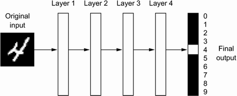
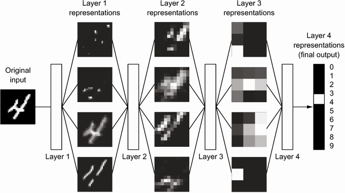
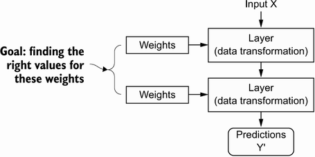
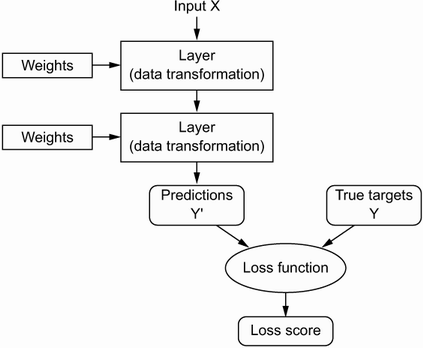
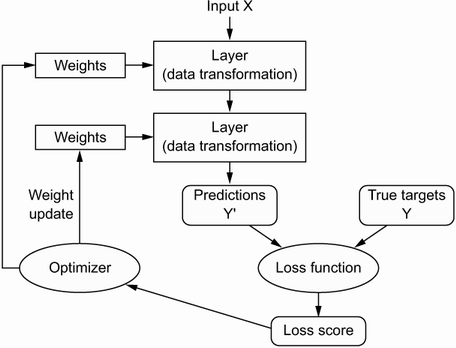

# Good evening

Hi all, my name is Pamela Krzypkowska and I will be teaching you about Deep Learning this semester. 
Some information about me:
1. I work as a Cloud Solution Architect specializing in AI @ Microsoft
2. I 💌 'Animal Crossing' and TikTok
3. I graduated Computer Science @ WUT and Philisophy @ UW

# What do you know about DL? 

If you have not done it already, please fill in the class form. The form is anonymous.
Tell me what you know about DL so the class can bring you more value: https://forms.office.com/r/bTCneHUzC6

# DL Intro

How it started:

  
Source: https://www.manning.com/books/deep-learning-with-python

How it's going:

Source: https://learning.oreilly.com/library/view/efficient-deep-learning/9781098117405/  

In the field of machine learning, deep learning, that is, learning with the help of multi-layer networks
of neurons is the fastest growing, and by many also considered the most important, method of all
other machine learning techniques.

So let's start with how the building blocks work:  

  

Multi layared perceptron:  

  

Backpropagation: https://towardsdatascience.com/understanding-backpropagation-algorithm-7bb3aa2f95fd  
Visual Intro to Neural Nets: https://www.youtube.com/watch?v=aircAruvnKk&list=PLZHQObOWTQDNU6R1_67000Dx_ZCJB-3pi

  

Looking under(ish) the hood:   

  
Source: https://www.manning.com/books/deep-learning-with-python 

Deep Learning in a few diagrams:

  

  

  s
Source: https://www.manning.com/books/deep-learning-with-python 

And what about the brain?

