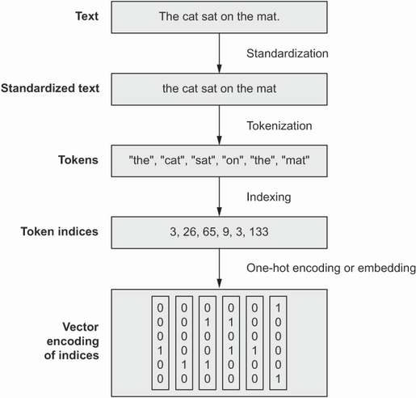
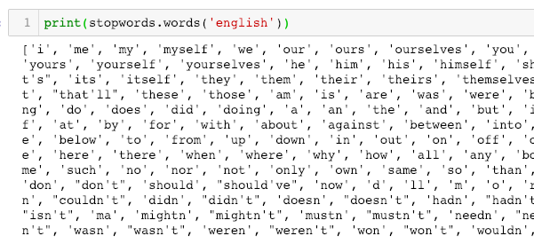
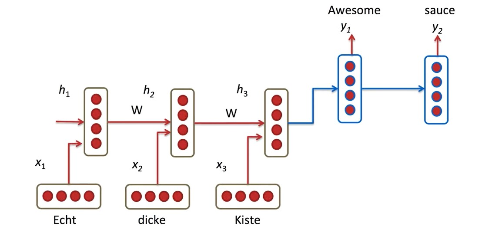
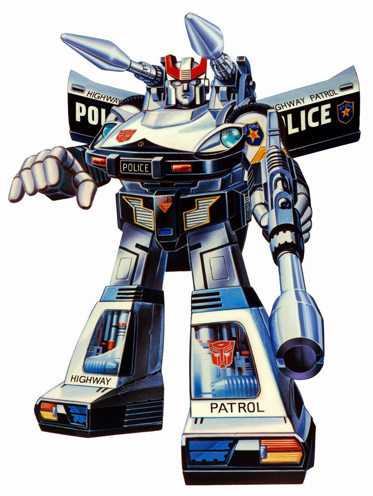
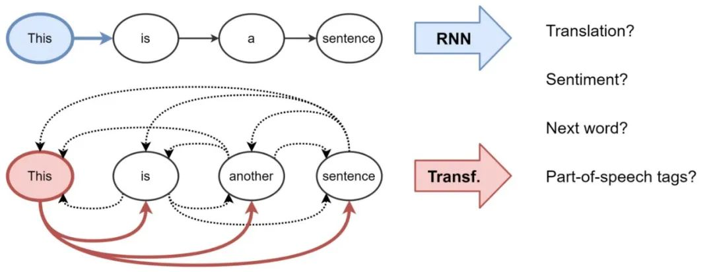

# Good evening again!

So lets start with:
1. Any questions, concerns or thoughts from our last lecture? 
2. So one from me, what did we talk about last time? 
3. And, what actually is a neural network?

Some quick terms to repeat:
1. Layer
2. Weight
3. Activation function
4. Loss
5. Batch
6. Epoch

# Let's talk about language 

Let us look at these examples:  
1. Not to brag, but I’m fluent in 10 languages. English and Binary.
2. Mary asked John to leave. Mary asked to leave John.
3. I made a great deal, killed two birds with one stone.

What types of problems do we solve:  
1. Where in the text can i find an answer to that question?
2. What is this text about?
3. How can i summarize this text?
4. Is that text appropriate?
5. How do I say that in french?

And more broadly:  
1. How can i answer this question?
2. What is the meaning of that sentence?
3. Was that funny? 
4. How does that relate to the world?

# How do we deal with words

  
Source: https://www.manning.com/books/deep-learning-with-python 

  

Let us make a representation:  

I love dogs and dogs love snacks.  
[1 2 3 4 3 2 5]  
Lets remember that networks (and any model to be fair) work on representations. We create representations to be as efficient as possible it means - take the least space and leave the most meaning.

# BERT

What is a model? It's a problem representation. In this case - a language representation.  

LSTMs are:
1. Slow to train
2. Rather unidirectional
3. No deep context perspective
4. No task separation

Well, the actual transformer:  

BERT:
1. aim to predict the relationships between sentences by analyzing them holistically, as well as token-level tasks such as named entity recognition and question answering.
2. is designed to pretrain deep bidirectional representations from unlabeled text by jointly conditioning on both
left and right context in all layers. 
3. can create state-of-the-art models for a wide range of tasks, such as question answering,
language inference and translation.

Source: https://aclanthology.org/N19-1423.pdf [BERT: Pre-training of Deep Bidirectional Transformers for
Language Understanding]  

Source: https://aclanthology.org/N19-1423.pdf [BERT: Pre-training of Deep Bidirectional Transformers for
Language Understanding]  

On SQuAD: https://rajpurkar.github.io/SQuAD-explorer/?msclkid=2b188d20c6c111ec90a8707c579811f9  

