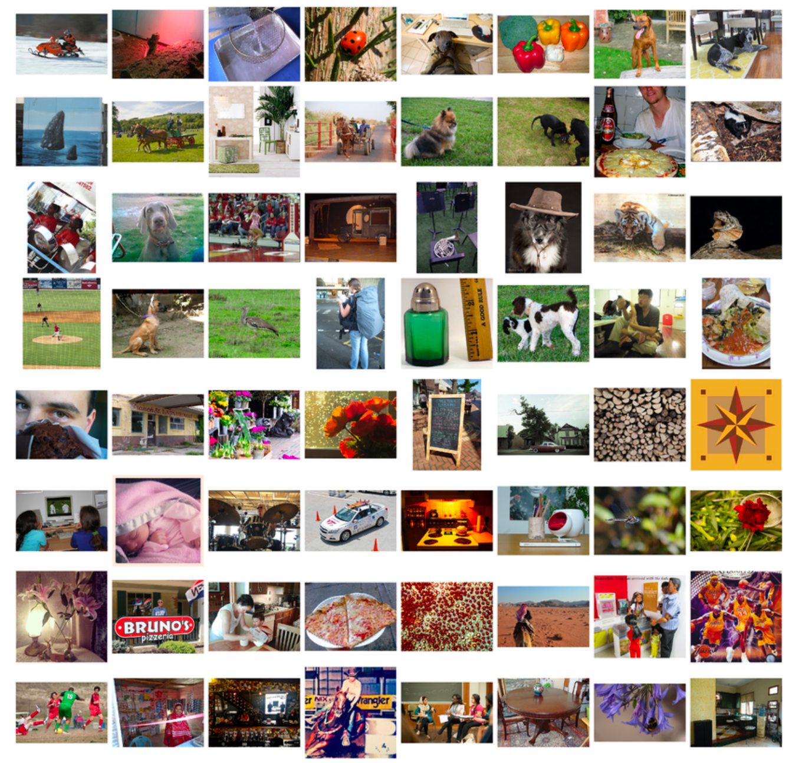
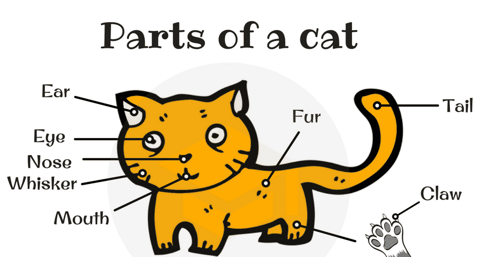

# Good evening again ^2!

So lets start with:
1. Any questions, concerns or thoughts from our last lecture? 
2. So one from me, what did we talk about last time? 
3. And, what problems do we need to address when building a model for language understanding?

Some quick terms to repeat:
1. Bag of words
2. Information bottleneck
3. Transformer
4. BERT

Two words about baselines  
  

# Let's now look at vision

One thing to remember is that Depp Learning rose to the recent promimance in 2010s because of problems related to vision, image recognition and image tagging. What we have with DL now, is because of a very famous algorithmic competition called ImageNet Large Scale Visual Recognition Challenge (ILSVRC), in short just ImageNet Challenge. In the challenge you had access to the data of over a milion images for training, that are put in a 1000 categories from "Strawberry", "Dog" to "Animal", overlapping each other in some cases.  

The whole ImageNet dataset has been manually tagged and consists of 14 milion images belonging to 20 000 classes. 

 

Do you see any problems with that?

The problems:
1. Manual annotation done by humans
2. Need for large dataset of examples
3. Is that the way we, humans think?

[Finally the brain!](../Class-04.20/Class-04.20.md)  

Getting back to the ImageNet:

In 2012 Alex Krivshevsky with his team designed a network that declassified the competition. The network achieved an error of 15.3%, around 11 percentage points lower than that next best one. This is crazy for ML standards, as you are probably aware. 

Deep dive into AlexNet: https://www.youtube.com/watch?v=7LQSdPjWjdA  

# So what is this convolution?

