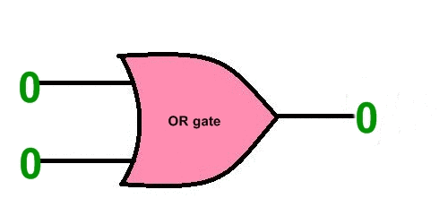
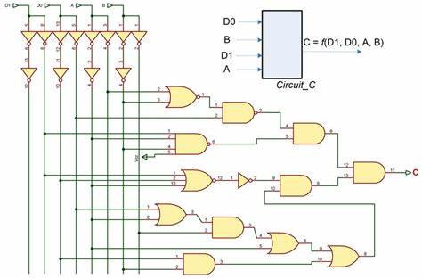
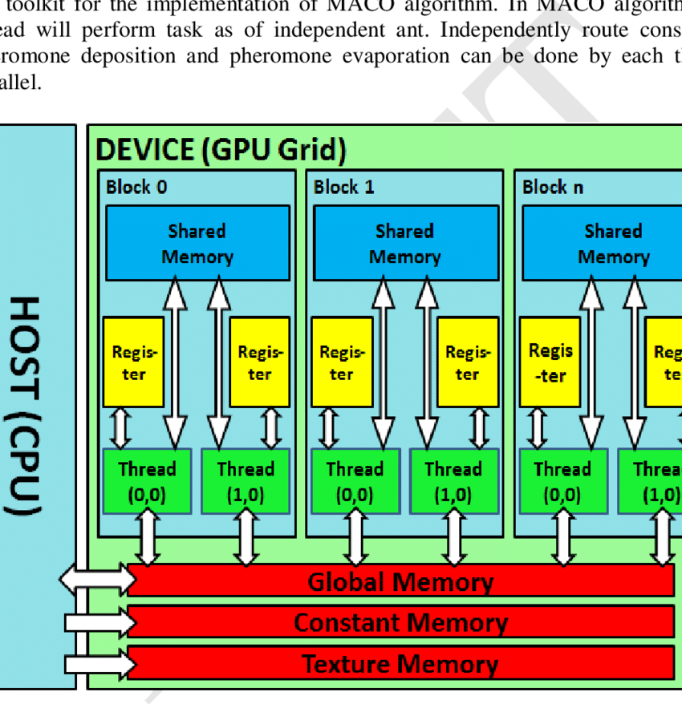
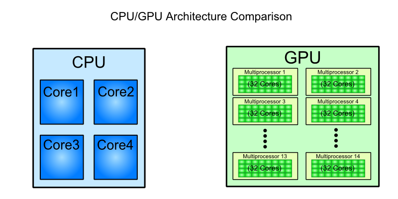
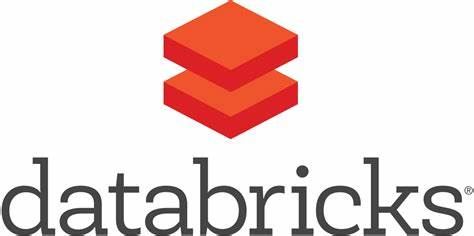
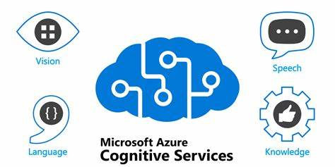

# Good evening again ^3!

So lets start with:
1. Any questions, concerns or thoughts from our last lecture? 
2. So one from me, what did we talk about last time? 
3. And, what problems do we encounter when training models for vision?

Some quick terms to repeat:
1. Convolutional Layer
2. MaxPooling Layer
3. ZlexNet
4. Baseline Model

# Processing Units

What is compute power?  
What is a CPU?  

  

And then...  

  

But for us, users - this is a transparent layer. We just need an object to do something for us.  

So what is this CPU?

  
More on how CPUs work here: https://www.youtube.com/watch?v=cNN_tTXABUA  

CPU is a single pair of hands:
 

But what if we need multiple pairs of hands?

  
More on how GPUs work here: https://www.youtube.com/watch?v=SrAMBi_8tIk
Even more on GPUs: https://www.youtube.com/watch?v=LfdK-v0SbGI 

Parralelism is the core of GPU. We have a lot of hands but these are smaller and less complex hands. Actually GPU cannot do anything that CPU cannot do. CPU just does it (usually) slower.

  

What GPU is good for (and why?):
1. Image rendering (in real time)
2. Deep Learning (https://www.youtube.com/watch?v=GRRMi7UfZHg & https://www.youtube.com/watch?v=EKD1kEMNeeU) 
3. Data mining
4. Cryptocurrency mining
5. Gaming

TPU - matrix processor, specifical for DL. Very fast matrix computation. No need for memory access.  

IPU: https://www.graphcore.ai/ & https://www.eejournal.com/article/20170119-ipu/  
More on CPU, GPU, TPU: https://www.youtube.com/watch?v=6ZDoFomU10A  

# CUDA 

 
CUDA intro (with GPU explanation) in 6 episodes: https://www.youtube.com/watch?v=4APkMJdiudU&list=PLC6u37oFvF40BAm7gwVP7uDdzmW83yHPe 

Example is in /code folder for you to [have a peek](code/cuda-example.cu).  
And if you have a GPU - give it a spin!

So how big should my rented apartment be to fit in all the cores?  

That's why:  

# Cloud in general and Azure in particular

Azure for students: https://azure.microsoft.com/en-us/free/students/  

  

Google Colab: https://colab.research.google.com/  
Only 1 core

Kaggle: https://www.kaggle.com/code/dansbecker/running-kaggle-kernels-with-a-gpu/notebook  
Only 2 cores

More on options: https://blog.paperspace.com/gradient-kaggle-notebook-comparison/#:~:text=Kaggle%3A%20GPU%3A%20TESLA%20P100%20with%202%20CPU%20cores,with%204%20CPU%20cores%20and%2016%20GB%20RAM  

Okey so now Azure!  

Services for ML and DL:

  

Services using DL (how and why):

