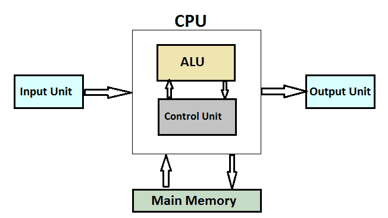

# Good evening again ^3!

So lets start with:
1. Any questions, concerns or thoughts from our last lecture? 
2. So one from me, what did we talk about last time? 
3. And, what problems do we encounter when training models for vision?

Some quick terms to repeat:
1. Convolutional Layer
2. MaxPooling Layer
3. ZlexNet
4. Baseline Model

# Processing Units

What is compute power?  
What is a CPU?  

  

And then...  

  

But for us, users - this is a transparent layer. We just need an object to do something for us.  

So what is this CPU?

  

CPU is a single pair of hands:
 

But what if we need multiple pairs of hands?

  

Parralelism is the core of GPU. We have a lot of hands but these are smaller and less complex hands. Actually GPU cannot do anything that CPU cannot do. CPU just does it (usually) slower.

What GPU is good for (and why?):
1. Image rendering (in real time)
2. Deep Learning
3. Data mining
4. Cryptocurrency mining
5. Gaming

# CUDA 

  

Example is in /code folder for you to [have a peek](code/cuda-example.cu).  
And if you have a GPU - give it a spin!

So how big should my rented apartment be to fit in all the cores?  

That's why:  

  
